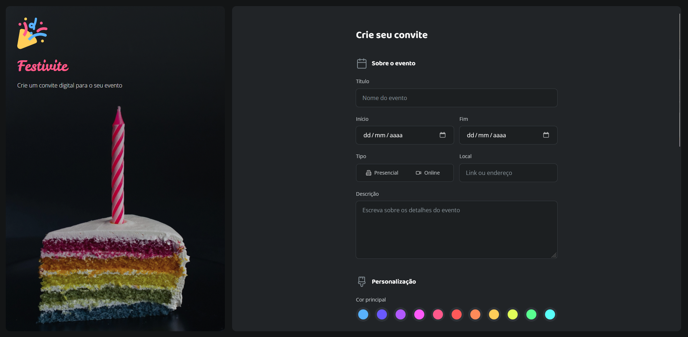

# 🎉 Festivite - Criador de Convites Digitais



---

## 📋 Sobre o Projeto

**Festivite** é uma plataforma web moderna e elegante para criação de **convites digitais personalizados**. Este projeto foi desenvolvido com foco especial em **estilização avançada de formulários e campos de entrada**, demonstrando as melhores práticas de design UI/UX utilizando apenas **HTML e CSS puro**, sem qualquer dependência externa de frameworks.

O projeto é um exemplo prático de como criar interfaces profissionais e responsivas, com componentes formulários altamente estilizados e um design visual atraente que oferece uma experiência de usuário excepcional.

### 🎯 Contexto do Projeto
- **Tipo**: Landing Page + Formulário Interativo
- **Foco**: Estilização de inputs, formulários e componentes de formulário
- **Tecnologias**: HTML5 + CSS3 puro
- **Tema**: Dark mode moderno com paleta de cores vibrantes

---

## 🎯 Objetivo

Este projeto demonstra a implementação de **boas práticas essenciais** no desenvolvimento frontend:

✅ **Estrutura HTML semântica e bem organizada**
✅ **Estilização CSS avançada de formulários**
✅ **Componentes reutilizáveis e escaláveis**
✅ **Tipografia profissional com Google Fonts**
✅ **Sistem de design com variáveis CSS**
✅ **Layout moderno com Flexbox e Grid**
✅ **Acessibilidade e UX otimizada**
✅ **Tema dark mode com paleta de cores harmoniosa**
✅ **Ícones SVG inline escaláveis**

---

## 🎨 Componentes / Funcionalidades

### 📐 **Elementos de Entrada (Inputs)**
- **Input de Texto**: Campos customizados com placeholder, focus e estados de ativação
- **Select/Combobox**: Menus dropdown estilizados
- **Textarea**: Áreas de texto expandíveis para descrições longas
- **Inputs Especializados**: Email, número, data, hora, cor

### 🔘 **Componentes de Seleção**
- **Checkboxes**: Elementos de seleção múltipla com estilo customizado
- **Radio Buttons**: Botões de seleção única com design moderno
- **Toggle Switches**: Alternadores on/off (se aplicável)

### 🎛️ **Botões**
- **Botão Primário**: CTA principal com hover e active states
- **Botão Secundário**: Ações complementares
- **Botão Desabilitado**: Estados de desabilitação clara

### 🏗️ **Estrutura de Seções**
- **Aside Sidebar**: Painel lateral com branding e descrição
- **Main Content**: Área principal com formul órios
- **Fieldsets Agrupados**: Organização temática dos inputs
- **Legends Descritivas**: Títulos de seções com ícones

### 💅 **Componentes Visuais**
- **Ícones SVG inline**: Integrados no HTML e estilizáveis via CSS
- **Cards e containers**: Agrupamento hierárquico de elementos
- **Spacing e alinhamento**: Sistema de espaçamentos consistente

---

## 📁 Estrutura de Pastas

```
convite/
│
├── index.html                  # Arquivo HTML principal - estrutura semântica
│
├── assets/                     # Recursos estáticos e mídias
│   ├── images/                 # Imagens em geral
│   ├── icons/                  # Ícones reutilizáveis
│   ├── colors/                 # Paleta de cores/referências
│   └── screenshots/            # Screenshots para documentação
│
└── styles/                     # Arquivos de estilização CSS
    ├── index.css               # Arquivo principal - importações
    ├── global.css              # Estilos globais, reset, variáveis CSS
    ├── layout.css              # Estrutura de layout (grid, flex)
    ├── forms.css               # Estilos base de formulários
    │
    └── fields/                 # Componentes específicos de formulário
        ├── index.css           # Importações dos campos
        ├── input.css           # Estilização de inputs
        ├── buttons.css         # Estilização de botões
        ├── checkbox.css        # Estilização de checkboxes
        └── radio.css           # Estilização de radio buttons
```

### 📝 Explicação da Estrutura

| Pasta/Arquivo | Propósito |
|---|---|
| `index.html` | Estrutura HTML semântica com todos os elementos e formulários |
| `global.css` | Estilos globais, reset CSS, definição de variáveis de design |
| `layout.css` | Layout com Flexbox e Grid |
| `forms.css` | Estilos base de fieldsets e containers de formulário |
| `fields/input.css` | Estilização específica de inputs, textareas e selects |
| `fields/buttons.css` | Estilos de botões com estados (hover, active, disabled) |
| `fields/checkbox.css` | Checkboxes customizados com animações |
| `fields/radio.css` | Radio buttons personalizados com transições |
| `assets/` | Logos, ícones SVG, imagens e screenshots |

---

## 🎯 Técnicas de Estilização Destacadas

### 🖌️ **1. Variáveis CSS (Custom Properties)**
```css
:root {
    --font-leckerli-one: "Leckerli One", cursive;
    --brand-light: #59B2FF;
    --input-base: #1C1F21;
    --shape-background: #131516;
}
```
**Impacto**: Centralização de valores, facilitando manutenção e tema switching, reutilização de padrões de design.

### 🎨 **2. Sistema de Tipografia com CSS Font Shorthand**
```css
--body-md: 400 1rem/normal var(--font-open-sans);
font: var(--body-md);
```
**Impacto**: Tipografia consistente em toda a aplicação, reduz duplicação, padroniza peso, tamanho e altura de linha.

### 📦 **3. CSS Grid para Layout de Formulários**
```css
fieldset {
    display: grid;
    gap: 1.5rem;
}
```
**Impacto**: Organização precisa e responsiva de elementos, alinhamento automático, espaçamento uniforme.

### ✨ **4. Estados de Entrada (Focus, Hover, Active, Disabled)**
```css
input:focus {
    border-color: var(--brand-light);
    box-shadow: 0 0 0 2px rgba(89, 178, 255, 0.1);
}

input:disabled {
    opacity: 0.5;
    cursor: not-allowed;
}
```
**Impacto**: Feedback visual claro ao usuário, melhor acessibilidade, UX intuitiva e responsiva.

### 🎭 **5. Pseudo-elementos para Customização**
```css
input[type="checkbox"] + label::before {
    content: "";
    display: inline-block;
    width: 20px;
    height: 20px;
    border: 2px solid var(--input-stroke);
}
```
**Impacto**: Campos de formulário customizados sem Javascript, total controle visual sobre checkboxes e radio buttons.

### 🌈 **6. Transições e Animações CSS**
```css
input, button, label {
    transition: all 0.3s cubic-bezier(0.4, 0, 0.2, 1);
}
```

### 🎯 **7. Paleta de Cores Organizada**
```css
--brand-light: #59B2FF;
--brand-mid: #3487CF;
--brand-dark: #1D6FB6;
--danger: #FF5959;
```
**Impacto**: Marca consistente, hierarquia visual clara, facilita manutenção de temas.

### 💡 **8. Seletores Avançados e Combinadores**
```css
fieldset + fieldset {
    margin-top: 3rem;
}

legend svg path {
    fill: var(--input-placeholder);
}
```
**Impacto**: CSS mais eficiente, sem classes desnecessárias, estilização contextual precisa.

### 📐 **9. Unidades Relativas (rem, %, em)**
```css
gap: 1.5rem;
width: 100%;
padding: 0.875rem;
```
**Impacto**: Escalabilidade, consistência, melhor para acessibilidade, fonte responsiva via rem.

---

## 📱 Características

### 🎨 **Design Moderno**
- Interface dark mode elegante e profissional
- Paleta de cores vibrantes e harmoniosas
- Tipografia premium com Google Fonts
- Ícones SVG escaláveis integrados

### ♿ **Acessibilidade**
- Semântica HTML5 correta
- Labels associadas aos inputs
- Contraste suficiente para leitura
- Navegação por teclado funcional

### ⚡ **Performance**
- CSS otimizado sem dependências externas
- Carregamento rápido
- Preconexão a fontes Google
- Sem JavaScript desnecessário

### 🎯 **User Experience**
- Feedback visual em todas as interações
- Estados claros (focus, hover, cheked)
- Validação visual instintiva
- Agrupamento lógico de campos

### 🔧 **Escalabilidade**
- Componentes reutilizáveis
- Código CSS bem organizado
- Variáveis para fácil manutenção
- Estrutura pronta para expansão

---

## 📚 Aprendizados Principais

Este projeto demonstra competência em:

### 1️⃣ **Domínio de HTML Semântico**
- Uso correto de tags semânticas (`<form>`, `<fieldset>`, `<legend>`, `<label>`)
- Associação apropriada de labels com inputs
- Estrutura acessível e bem organizada
- Atributos HTML5 (type, placeholder, required, etc.)

### 2️⃣ **CSS Avançado**
- Variáveis CSS (Custom Properties) para design sistemas
- Seletores complexos e combinadores
- Pseudo-classes (`:hover`, `:focus`, `:active`, `:disabled`)
- Pseudo-elementos (`::before`, `::after`)

### 3️⃣ **Design System e Tokens**
- Paleta de cores coordenada
- Tipografia padronizada
- Espaçamento consistente (spacing scale)
- Componentes reutilizáveis

### 4️⃣ **Layout**
- Flexbox e CSS Grid
- Media queries inteligentes
- Mobile-first approach
- Breakpoints bem planejados

### 5️⃣ **Estilização de Formulários**
- Inputs customizados sem JavaScript
- Checkboxes e radio buttons personalizados
- Botões com múltiplos estados
- Fieldsets e agrupamentos visuais

### 6️⃣ **Boas Práticas CSS**
- Organização modular dos arquivos
- Nomenclatura clara e consistente
- DRY (Don't Repeat Yourself)
- Manutenibilidade e escalabilidade

### 7️⃣ **Animações e Transições**
- Easing functions para movimento natural
- Transições suaves entre estados
- Performance otimizada
- Feedback visual imediato

### 8️⃣ **Ícones e Gráficos**
- SVG inline escalável
- Integração com CSS
- Otimização de tamanho
- Sem dependência de icon fonts

---

## 🛠️ Tecnologias Utilizadas

| Tecnologia | Versão | Propósito |
|---|---|---|
| **HTML** | 5 | Estrutura semântica e acessível |
| **CSS** | 3 | Estilização avançada e responsiva |
| **Google Fonts** | Latest | Tipografia premium (Baloo 2, Open Sans, Leckerli One) |
| **SVG** | 1.1 | Ícones vetoriais escaláveis |

---

## 💡 Dicas para Exploração

### Inspecionar Componentes
- Use F12 para abrir o DevTools
- Analise as variáveis CSS em `global.css`
- Veja como os inputs são estilizados em `fields/input.css`

### Adaptar Cores
- Modifique as variáveis em `:root` no `global.css`
- Todas as cores da interface se atualizam automaticamente
- Teste diferentes paletas de cores

### Expandir Funcionalidades
- Adicione novos tipos de input
- Crie novos estados visuais
- Implemente validação visual com CSS

---

## 📝 Notas Importantes

- ✅ Este projeto usa **apenas HTML e CSS** - sem JavaScript
- ✅ Segue as **melhores práticas** de design e acessibilidade
- ✅ Código **bem documentado** e fácil de manter
- ✅ Pronto para **produção** com otimizações implementadas

---

## 🤝 Contribuições

Este é um projeto de estudo pessoal. Sugestões e feedback são bem-vindos!

---

